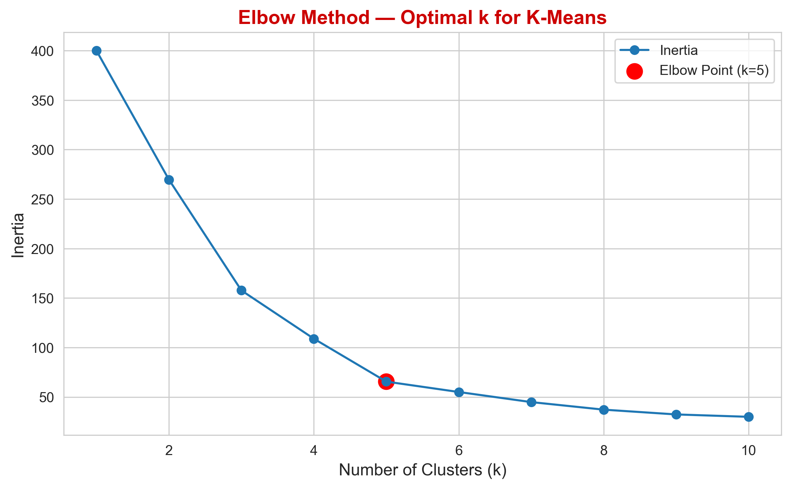
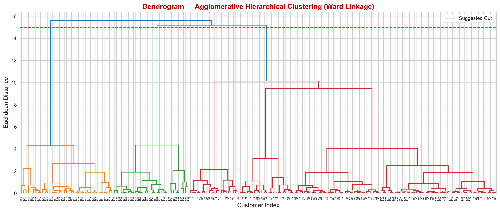
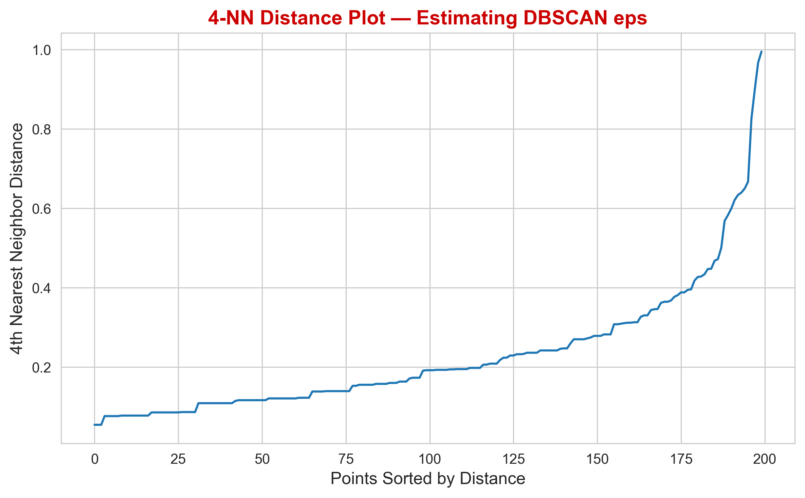
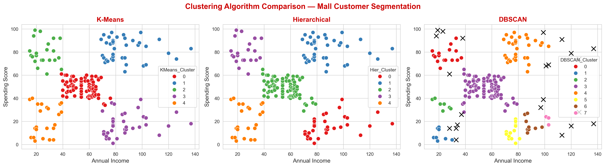

# 🛍️ Mall Customer Segmentation using Unsupervised Learning


---

## 📑 Table of Contents

- [📌 Project Overview](#-project-overview)
- [📂 Dataset](#-dataset)
- [🤖 Algorithms Implemented](#-algorithms-implemented)
- [📊 Screenshots](#-screenshots)
- [🛠️ Tools & Technologies](#️-tools--technologies)
- [📦 Requirements](#-requirements)
- [📁 Project Structure](#-project-structure)
- [🎥 Project Demonstration](#-project-demonstration)
- [📄 Repository Files](#-repository-files)
- [👨‍💻 Author](#-author)

---

## 📌 Project Overview

This project applies **Unsupervised Machine Learning** techniques to segment mall customers based on their purchasing behavior.

The objective is to identify distinct customer groups that can help businesses create targeted marketing strategies and improve customer engagement.

Three clustering algorithms are implemented and compared:

- K-Means Clustering
- Agglomerative Hierarchical Clustering
- DBSCAN


---

## 📂 Dataset

**Dataset Name**
Mall Customers Dataset

**Source**
https://www.kaggle.com/datasets/vjchoudhary7/customer-segmentation-tutorial-in-python

**Features Used**

- Gender
- Age
- Annual Income (k$)
- Spending Score (1–100)

---

## 🤖 Algorithms Implemented

### 1. K-Means Clustering

K-Means partitions customers into a predefined number of clusters by minimizing the distance between customers and their cluster centroids.

---

### 2. Agglomerative Hierarchical Clustering

Hierarchical Clustering builds clusters by iteratively merging the closest groups and visualizes the hierarchy using a dendrogram.

---

### 3. DBSCAN

DBSCAN groups customers based on density and automatically detects noise and outliers without requiring the number of clusters beforehand.

---

## 📊 Screenshots

### Elbow Method
Elbow Method for selecting the optimal number of clusters.




**💡 Insight :** The elbow appears at **K = 5**, indicating that five clusters provide a good balance between model complexity and clustering performance.

---

### Hierarchical Dendrogram
Hierarchical clustering using Ward linkage.




**💡 Insight :** The dendrogram suggests a clear separation into **five major customer groups**, supporting the choice of five clusters used in the clustering analysis.

---

### K-Distance Plot
K-Distance graph for estimating the optimal epsilon value.




**💡 Insight :** The noticeable bend in the curve helps estimate an appropriate **eps** value for DBSCAN, enabling effective identification of dense regions and noise points.

---

### Algorithm Comparison
Comparison of customer segments generated by K-Means, Hierarchical Clustering, and DBSCAN.




**💡 Insight :** K-Means and Hierarchical Clustering produce similar well-defined customer groups, while DBSCAN additionally identifies sparse regions and potential outliers that are treated as noise.

---

## 🛠️ Tools & Technologies

- Python
- Jupyter Notebook
- VS Code
- NumPy
- Pandas
- Matplotlib
- Seaborn
- Scikit-learn
- SciPy

---

## 📦 Requirements

Install the required libraries using:

```bash
pip install -r requirements.txt
```

---

## 📁 Project Structure

```
Mall_Customer_Segmentation/
│
├── data/
│   └── Mall_Customers.csv
│
├── notebooks/
│   └── Mall_Customer_Segmentation_Clustering.ipynb
│
├── screenshots/
│   ├── age_distribution.png
│   ├── annual_income_distribution.png
│   ├── spending_score_distribution.png
│   ├── pairplot.png
│   ├── correlation_heatmap.png
│   ├── elbow_method.png
│   ├── silhouette_score.png
│   ├── kmeans_clusters.png
│   ├── dendrogram.png
│   ├── hierarchical_clusters.png
│   ├── kmeans_vs_hierarchical.png
│   ├── dbscan_eps_plot.png
│   ├── dbscan_clusters.png
│   └── algorithm_comparison.png
│
├── Mall_Customer_Segmentation_Clustering.html
├── README.md
└── requirements.txt
```

---

## 🎥 Project Demonstration

Video Link:

> *(Add your Google Drive / YouTube video link here.)*

---


## 📄 Repository Files

- ✔️ [Mall_Customer_Segmentation_Clustering.ipynb](notebooks/Mall_Customer_Segmentation_Clustering.ipynb)
- ✔️ [Mall_Customer_Segmentation_Clustering.html](Mall_Customer_Segmentation_Clustering.html)
- ✔️ [screenshots](screenshots)
- ✔️ [requirements.txt](requirements.txt)
- ✔️ [README.md](README.md)

---

## 👨‍💻 Author

**Paree G. Sojitra**

> *Passionate about Data Science, Machine Learning, and transforming data into meaningful insights. 🚀*

GitHub: **[PareeSojitra0803](https://github.com/PareeSojitra0803)**